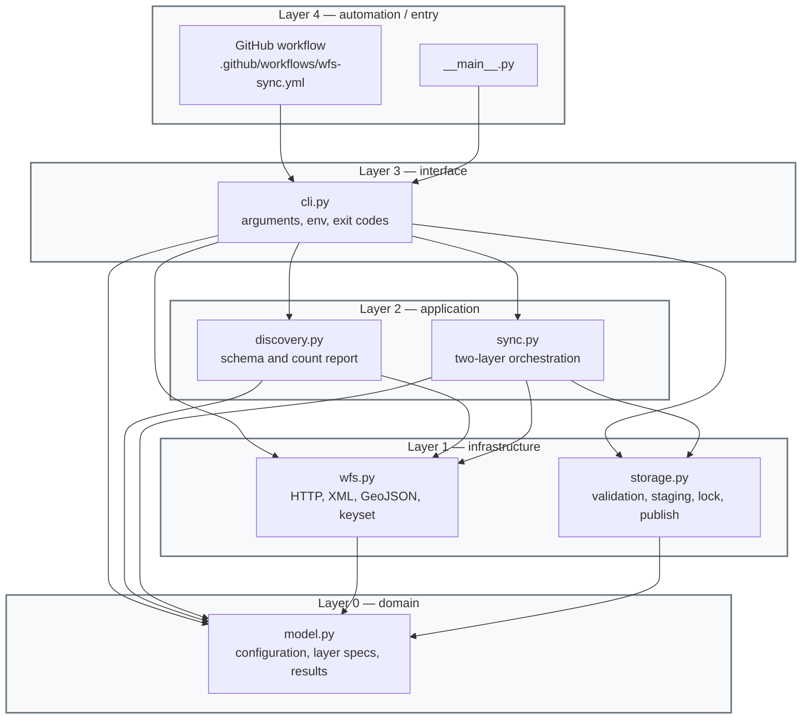
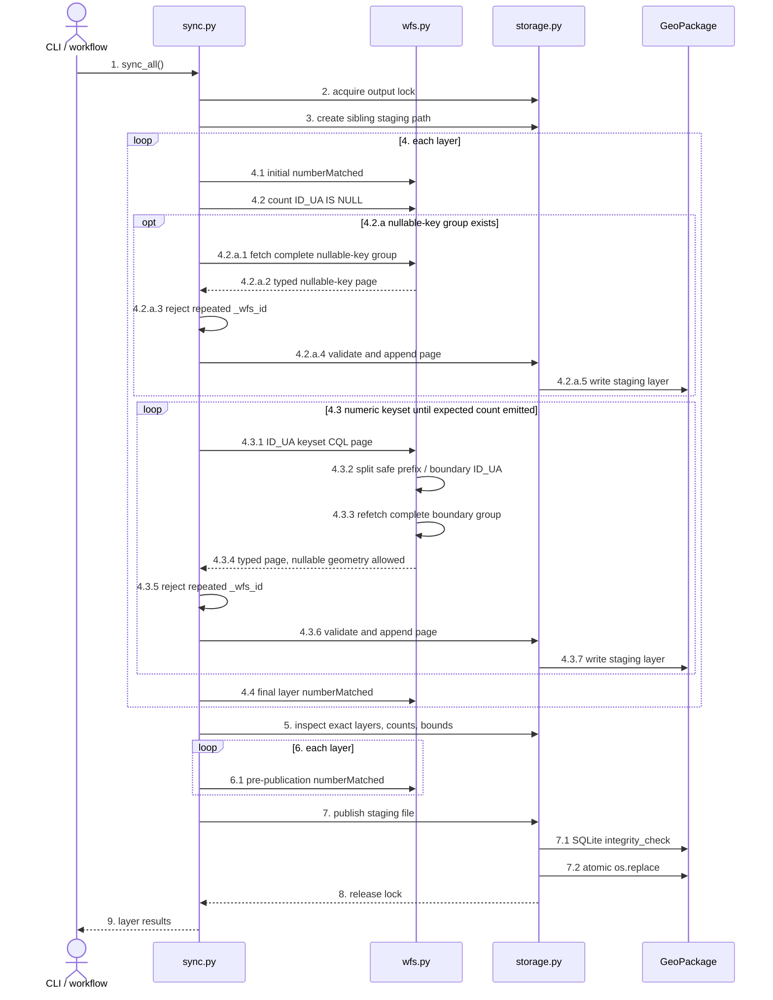

# WFS sync — architecture

## Layered DAG

Arrows mean module dependency or entrypoint invocation. Subgraph borders separate architectural layers; no dependency violates the downward DAG.

- `model.py`
  - fixed source/output mappings
  - field types
  - sort expressions
- `wfs.py`
  - bounded retries / timeout
  - WFS exceptions
  - WFS 2.0 hits and features
  - WFS 1.1 schema fallback for server defect
  - typed GeoDataFrames
- `storage.py`
  - frame checks
  - page append
  - exact layer-set inspection
  - SQLite integrity check
  - exclusive output lock
- `sync.py`
  - counts and unique IDs
  - both layers or no publication
- `discovery.py`
  - strict schema validation
  - full-sync rationale

## Sync sequence

Numbered messages form the synchronization pseudocode. The layer loop covers points, then parcels.

- `1–3`
  - one run, one lock, one staging file
- `4.2–4.2.a`
  - count nullable keys once
  - fetch one complete `ID_UA IS NULL` group when present
- `4.3.1`
  - first numeric page: `ID_UA IS NOT NULL`
  - later pages: `ID_UA > cursor`
- `4.3.2–4.3.3`
  - boundary tie excluded from prefix
  - equality query retrieves the entire tied group
- `4.2.a.2`, `4.3.4`
  - source types normalized
  - parcel `NULL` geometry retained
- `4.4`, `6.1`
  - abort on count drift
- `7`
  - only fully verified two-layer file becomes visible
- failure path
  - staging removed
  - destination unchanged
  - lock released
