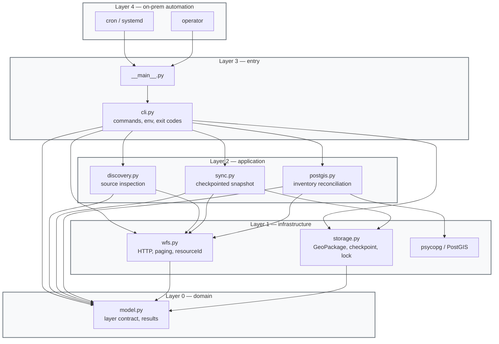

# WFS sync — architecture

## Layered DAG

Arrows mean invocation or import dependency. No dependency points to a higher layer, so there are no red DAG violations.



- Domain
  - fixed two-layer contract
  - source/output names, attributes, geometry families
- Infrastructure
  - WFS 2.0 transfer; WFS 1.1 schema fallback
  - bounded retries and timeouts
  - durable file operations
- Application
  - snapshot and database paths independent
  - shared WFS and layer contract
- Entry / automation
  - one CLI
  - cron or manual invocation
  - no GitHub Actions scheduler

## Execution sequence

Numbered messages form the pseudocode. The `alt` branches show the full disk checkpoint path and the recurring PostGIS path.

```mermaid
sequenceDiagram
    actor Run as cron / operator
    participant CLI as CLI
    participant App as sync.py / postgis.py
    participant WFS as eProstor WFS
    participant Disk as GeoPackage + checkpoint
    participant DB as PostGIS eprostor

    Run->>CLI: 1. invoke command
    CLI->>App: 2. construct client and operation

    alt checkpointed full snapshot
        App->>Disk: 3.a acquire flock; load checkpoint
        App->>WFS: 3.b validate live contract and counts
        loop 3.c each layer and key boundary
            App->>WFS: 3.c.1 fetch complete feature page
            WFS-->>App: 3.c.2 typed GeoDataFrame
            App->>Disk: 3.c.3 append partial GeoPackage
            App->>Disk: 3.c.4 atomically save checkpoint
        end
        App->>Disk: 3.d validate layers, counts, integrity
        App->>Disk: 3.e atomic file replace; finalize manifest + SHA-256
    else inventory-reconciled database sync
        App->>DB: 4.a acquire PostgreSQL advisory lock
        App->>WFS: 4.b read initial counts
        loop 4.c each layer
            App->>WFS: 4.c.1 stream geometry-free CSV inventory
            App->>DB: 4.c.2 COPY inventory into temporary table
            App->>DB: 4.c.3 derive wanted and missing IDs
            App->>WFS: 4.c.4 resourceId fetch wanted features
            App->>DB: 4.c.5 COPY features into temporary table
        end
        App->>WFS: 4.d verify final counts
        App->>DB: 4.e begin one transaction
        App->>DB: 4.f upsert, delete missing, verify counts
        App->>DB: 4.g write sync_state; commit both layers
    end

    App-->>CLI: 5. structured layer results
    CLI-->>Run: 6. JSON and exit code
```

- `1–2`
  - global configuration before subcommand
- `3.a`
  - automatic resume
  - `--restart`: discard only partial state under lock
- `3.b`
  - endpoint, CRS, layers, source schema fingerprints
  - changed count or contract: explicit restart required
- `3.c.3–3.c.4`
  - checkpoint after completed page append
  - completed layer skipped after resume
- `3.d–3.e`
  - old published snapshot untouched until validated file replacement
  - crash after rename recovered from completed checkpoint
- `4.b–4.d`
  - inventory and features staged before target mutation
  - count drift aborts run
- `4.c.3`
  - wanted: new, changed timestamp, or null timestamp
  - missing: target WFS ID absent from inventory
- `4.c.4`
  - batched `resourceId`
  - omitted batch member: individual retry
- `4.e–4.g`
  - two target tables and `sync_state`
  - one atomic commit
- failure
  - non-zero exit
  - checkpoint retained for snapshot resume
  - database target unchanged before final transaction
