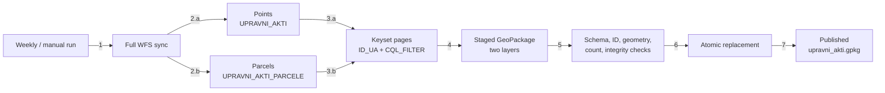

# WFS sync — general idea

## Main concepts

Weekly, deletion-safe replacement of both administrative-act layers.

- `1`
  - scheduled or manual full run
- `2.a–2.b`
  - both source feature types
- `3.a–3.b`
  - independent keyset transfer per layer
- `4–5`
  - one staged file; validate before exposure
- `6–7`
  - atomic promotion to published result

- Source
  - eProstor public WFS
  - WFS 2.0 data transfer
  - `EPSG:3794`
- Destination
  - `upravni_akti_tocke`
  - `upravni_akti_parcele`
  - one GeoPackage
- Sync mode
  - full replacement
  - weekly default
  - no deletion/tombstone feed
  - `ZAD_SPR` insufficient for deleted records
- Paging
  - keyset cursor: `ID_UA`
  - `CQL_FILTER`
  - complete `ID_UA IS NULL` group first
  - complete boundary-group refetch
  - safe with repeated `ID_UA`
- Publication
  - both layers staged together
  - previous result retained on failure
  - `os.replace` only after validation
- Geometry
  - points when present: `Point`
  - parcels when present: `Polygon` / `MultiPolygon`
  - source parcel rows with `NULL` geometry preserved

## Correctness boundary

- Detects
  - count drift
  - duplicate / missing WFS IDs
  - stalled keyset cursor
  - schema / CRS / geometry mismatch
  - invalid staged GeoPackage
- WFS limitation
  - no transactional snapshot
  - equal-count concurrent source changes may remain undetected
