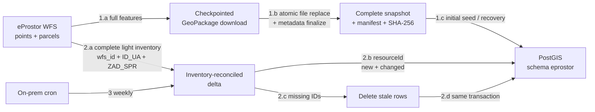

# WFS sync — general idea

## Main concepts

Two complementary paths: resumable full snapshot on disk; small recurring database transfer with complete deletion reconciliation.

- `1.a`
  - both layers
  - keyset paging by `ID_UA`
  - persistent partial file + JSON checkpoint
- `1.b`
  - exact counts and layers
  - SQLite integrity check
  - atomic GeoPackage replacement
  - recoverable manifest / checksum finalization
- `1.c`
  - optional first database load
  - bounded-memory GeoPackage chunks
- `2.a`
  - no geometry
  - complete current WFS-ID set
- `2.b`
  - only absent or changed IDs
  - `ZAD_SPR IS NULL`: refreshed every run
- `2.c–2.d`
  - target IDs absent from inventory
  - upserts, deletes, and sync state committed together
- `3`
  - Python CLI on own server
  - PostgreSQL advisory lock against overlap

## Data identity

- Layers
  - `SI.MOP.GRAD:UPRAVNI_AKTI` → `eprostor.upravni_akti_tocke`
  - `SI.MOP.GRAD:UPRAVNI_AKTI_PARCELE` → `eprostor.upravni_akti_parcele`
- Primary mirror key
  - WFS feature ID → `wfs_id`
  - required for both layers
  - parcel `ID_UA`: not unique
  - disk: every raw source row preserved
  - PostGIS: identical duplicate IDs → one row
  - PostGIS: conflicting duplicate IDs → rejected
- Date typing
  - valid XSD years outside pandas nanosecond range preserved
  - example source edge: year `0002`
- Geometry
  - CRS: `EPSG:3794`
  - points: `Point`
  - parcels: `MultiPolygon`
  - source `NULL` geometry preserved

## Correctness boundary

- Protected
  - interruption: resume from last durable key boundary
  - failure before file replacement: old snapshot retained
  - failure during metadata finalization: completed checkpoint recovery
  - deletion: complete inventory reconciliation
  - failed database reconciliation: both layers rolled back
  - overlapping local / database runs: locks
  - unexpected empty source over existing mirror: deletion refused
  - bootstrap: publication manifest + SHA-256 required
  - live WFS schema drift: database sync refused
- WFS limitation
  - no transactional source snapshot
  - counts checked before and after transfer
  - rare equal-count concurrent replacement may converge next run
