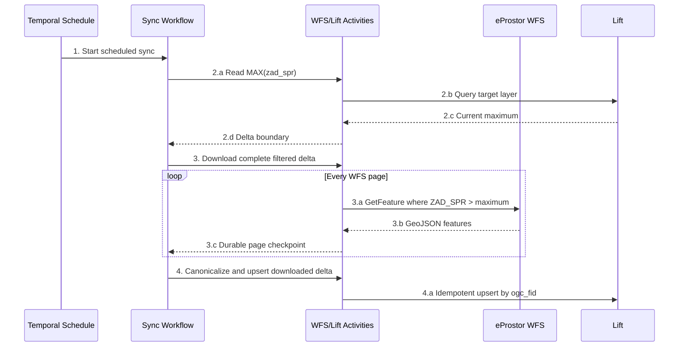

# eProstor WFS administrative acts — data reference

This document records the verified behavior of the public eProstor WFS layers
for administrative acts related to construction. It covers the source,
published schemas, identifiers, timestamps, observed data anomalies, and the
rules used by the synchronization implementation.

Operational commands and deployment instructions remain in [README.md](README.md).

## Implementation decisions

| Concern | Decision |
|---|---|
| Orchestration | Python Temporal workflow and Activities |
| Parcel target | `MOP - Upravni akti (parcele)` / `si_mop_ua_parc` |
| Point target | `MOP - Upravni akti (točke)` / `si_mop_ua_tock` |
| Upsert identity | Current WFS FID numeric suffix → Lift `ogc_fid` |
| Change selection | `ZAD_SPR > MAX(target.zad_spr)` |
| Watermarks | Derived from each target table; no separate state |
| Deletions | None |
| Bootstrap | Verified GeoPackage or complete paged WFS read |
| Null timestamps | Loaded by bootstrap; not selected by recurring delta |

## Source

### Catalogue record

- Metadata:
  `https://eprostor.gov.si/imps/srv/api/records/ff907852-18ca-426f-a100-5631ca5fa95c`
- Public WFS:
  `https://storitve.eprostor.gov.si/ows-pub-wfs/wfs`
- Service implementation: GeoServer WFS
- Working feature protocol: WFS 2.0.0
- Schema fallback used by the client: individual WFS 1.1.0
  `DescribeFeatureType` requests
- Source/output CRS: `EPSG:3794` — Slovenia 1996 / Slovene National Grid

The catalogue URL describes the dataset. Feature data is downloaded from the
WFS URL.

### Useful WFS requests

Get the service and layer description:

```text
https://storitve.eprostor.gov.si/ows-pub-wfs/wfs?service=WFS&version=2.0.0&request=GetCapabilities
```

Get the schema of the point layer:

```text
https://storitve.eprostor.gov.si/ows-pub-wfs/wfs?service=WFS&version=1.1.0&request=DescribeFeatureType&typeName=SI.MOP.GRAD:UPRAVNI_AKTI
```

Get the current row count without transferring features:

```text
https://storitve.eprostor.gov.si/ows-pub-wfs/wfs?service=WFS&version=2.0.0&request=GetFeature&typeNames=SI.MOP.GRAD:UPRAVNI_AKTI&resultType=hits
```

Get a geometry-free delta inventory:

```bash
curl -G 'https://storitve.eprostor.gov.si/ows-pub-wfs/wfs' \
  --data 'service=WFS' \
  --data 'version=2.0.0' \
  --data 'request=GetFeature' \
  --data 'typeNames=SI.MOP.GRAD:UPRAVNI_AKTI_PARCELE' \
  --data 'outputFormat=csv' \
  --data 'propertyName=ID_UA,ZAD_SPR' \
  --data 'count=5000' \
  --data-urlencode 'sortBy=ID_UA A'
```

The parcel response contains no geometry:

```csv
FID,ID_UA,ZAD_SPR
UPRAVNI_AKTI_PARCELE.737,3,2020-12-22T00:00:00
UPRAVNI_AKTI_PARCELE.352528,4,2020-12-22T00:00:00
```

For points, GeoServer also returns three mandatory display attributes, but
still no geometry:

```csv
FID,ID_UA,SIF_VRS_UA_KRA_SIF,VRS_AKT_2,NAZ_UPR_POS,ZAD_SPR
```

The full source must still be paged, but an inventory page is much smaller
than full GeoJSON. The planned filter-only Lift integration does not require
this inventory; it remains useful for diagnostics and any future deletion
reconciliation.

Fetch full features changed after a time:

```bash
curl -G 'https://storitve.eprostor.gov.si/ows-pub-wfs/wfs' \
  --data 'service=WFS' \
  --data 'version=2.0.0' \
  --data 'request=GetFeature' \
  --data 'typeNames=SI.MOP.GRAD:UPRAVNI_AKTI' \
  --data 'outputFormat=application/json' \
  --data 'srsName=EPSG:3794' \
  --data-urlencode "CQL_FILTER=ZAD_SPR > '2026-07-01T00:00:00Z'"
```

The live service accepts all three tested forms:

```text
ZAD_SPR > '2026-07-01T00:00:00Z'
ZAD_SPR >= '2026-07-01T00:00:00Z'
ZAD_SPR AFTER 2026-07-01T00:00:00Z
```

Live results verified on 2026-07-27:

| Filter | Points | Parcels |
|---|---:|---:|
| `ZAD_SPR > '2026-07-01T00:00:00Z'` | 2,478 | 3,406 |
| `ZAD_SPR IS NULL` | 1 | 14 |

The service supports overlap and null selection, but the selected Lift
integration deliberately uses the simpler strict maximum filter:

```text
CQL_FILTER=ZAD_SPR > '<MAX(target.zad_spr)>'
```

Fetch complete current features by WFS identity:

```text
https://storitve.eprostor.gov.si/ows-pub-wfs/wfs?service=WFS&version=2.0.0&request=GetFeature&typeNames=SI.MOP.GRAD:UPRAVNI_AKTI_PARCELE&outputFormat=application/json&srsName=EPSG:3794&resourceId=UPRAVNI_AKTI_PARCELE.519563
```

The production client also supplies bounded counts, keyset CQL filters, retry
timeouts, and exact response validation.

## Published layers

| WFS type name | Local name | Meaning | Geometry |
|---|---|---|---|
| `SI.MOP.GRAD:UPRAVNI_AKTI` | `upravni_akti_tocke` | Locations of administrative acts | `Point` |
| `SI.MOP.GRAD:UPRAVNI_AKTI_PARCELE` | `upravni_akti_parcele` | Administrative-act/parcel associations | `Polygon`, stored as `MultiPolygon` |

The parcel layer is **not a canonical parcel register**. A row means that one
administrative act is associated with one cadastral parcel. One act can
therefore produce many parcel rows.

### Snapshot measured on 2026-07-24

| Layer | Raw WFS rows | Unique WFS IDs | `ZAD_SPR IS NULL` |
|---|---:|---:|---:|
| Points | 234,486 | 234,475 | 1 |
| Act/parcel associations | 630,026 | 630,012 | 14 |

The raw counts include identical duplicate WFS IDs. The downloaded GeoPackage
preserves every published row. The PostGIS mirror stores one canonical row per
WFS ID.

### GeoPackage size

The completed file is 538,370,048 bytes, or 513.43 MiB.

| Layer | Feature table | Spatial indexes | Total |
|---|---:|---:|---:|
| Act/parcel associations | 397.34 MiB | 32.47 MiB | 429.81 MiB |
| Points | 71.40 MiB | 12.14 MiB | 83.54 MiB |
| GeoPackage metadata |  |  | approximately 0.08 MiB |

- Parcels: approximately 83.7% of the file
- Points: approximately 16.3% of the file

## Field reference

`DescribeFeatureType` publishes field names, XML types, and nullability, but
not a complete business glossary. Meanings marked **name-derived** should be
confirmed with the eProstor data owner before being used for legal or business
decisions.

### Point layer

| Field | Stored type | Role or likely meaning |
|---|---|---|
| `ID_UA` | integer | Administrative-act identifier; verified integration attribute, but not used as the mirror primary key |
| `SIF_PU` | integer | Published code; exact business definition not present in the WFS schema |
| `NAZ_UPR_ORG` | text | Name of the administrative organisation, name-derived |
| `STEV_ZAD` | text | Case/reference number, name-derived |
| `OB_ID` | integer | Municipality identifier, name-derived |
| `SIF_VRS_UA_KRA_SIF` | text | Published administrative-act classification code |
| `VRS_AKT_2` | text | Published secondary act-type code/label |
| `NAZ_UPR_POS` | text | Published administrative-procedure/act name |
| `OBJ` | text | Object/subject description, name-derived |
| `DAT_IZD` | timestamp | Published date field; likely issue date |
| `DAT_POP` | timestamp | Published date field; exact business definition not present in the schema |
| `MAX_DAT_PRA` | timestamp | Published date field; exact business definition not present in the schema |
| `DAT_RAZ` | timestamp | Published date field; exact business definition not present in the schema |
| `ZAD_SPR` | timestamp | Last source change; used for delta comparison |
| `VRS_AKT` | integer | Administrative-act type code |
| `DAT_ZAC_GRA` | timestamp | Published construction-start date, name-derived |
| `GEOMETRY` | geometry | Point location; GeoServer may duplicate it inside properties and top-level GeoJSON |

### Act/parcel layer

| Field | Stored type | Role or likely meaning |
|---|---|---|
| `ID_UA` | integer | Administrative act associated with the parcel |
| `OB_ID` | integer | Municipality identifier, name-derived |
| `SIFKO` | integer | Cadastral municipality code |
| `PARCELA` | text | Parcel number; kept as text because values include `/` and `*` |
| `ZAD_SPR` | timestamp | Last source change; used for delta comparison |
| `VRS_AKT` | integer | Administrative-act type code |
| `BARVA_POLIGONA` | text | Hex display colour, for example `#cc2a12` |
| `GEOMETRY` | geometry | Parcel polygon, normalized to `MultiPolygon` in PostGIS |

Older exports can expose `BARVA_POLIGONA` under a shortened physical name such
as `barva_poli`. This is a format/loader naming limitation, not a different
business field.

## Identity and primary keys

### Identifier mapping

| Location | Identifier |
|---|---|
| WFS CSV inventory | `FID` |
| WFS GeoJSON | top-level feature `id` |
| Raw GeoPackage | `_wfs_id` |
| PostGIS mirror | `wfs_id TEXT PRIMARY KEY` |
| GeoPackage internals | `fid`, a local GeoPackage row ID |
| Older imported table | `ogc_fid`, a technical row/export ID |

Use the current WFS feature ID as the canonical identity during synchronization:

```text
FID → _wfs_id → wfs_id
```

Do **not** use these as the delta primary key:

- `ID_UA`: one act can have many parcel rows.
- `SIFKO + PARCELA`: the same parcel can be associated with multiple acts.
- GeoPackage `fid`: generated by the local file.
- Old `ogc_fid`: generated or assigned by the previous export/table and not
  stable across snapshots.

Current distinct-value evidence:

| Layer | Raw rows | Distinct `ID_UA` | Distinct WFS IDs |
|---|---:|---:|---:|
| Points | 234,486 | 234,475 | 234,475 |
| Parcels | 630,026 | 233,806 | 630,012 |

### Duplicate WFS IDs

The live service currently publishes:

- 11 additional point rows sharing an existing WFS ID
- 14 additional parcel rows sharing an existing WFS ID

The observed duplicates are byte-for-byte identical for the same identity.
Rules:

1. Preserve all raw rows in the archival GeoPackage.
2. Canonicalize identical WFS-ID duplicates to one PostGIS row.
3. Abort if two rows with the same WFS ID contain conflicting data.

### WFS-ID stability

The service does not formally document long-term stability of feature IDs.
Observed historical data proves that old technical IDs cannot be matched
directly to current WFS IDs.

Example from the older 491,885-row table:

| Attribute | Old snapshot | Current snapshot |
|---|---|---|
| Technical ID | `ogc_fid=491885` | `_wfs_id=UPRAVNI_AKTI_PARCELE.519563` |
| `ID_UA` | 314428 | 314428 |
| `OB_ID` | 106 | 106 |
| `SIFKO` | 2635 | 2635 |
| `PARCELA` | `138/4` | `138/4` |
| `VRS_AKT` | 3 | 3 |
| Colour | `#cc2a12` | `#cc2a12` |

The business row is the same while its technical identifier changed. With the
selected no-delete policy, a WFS-ID change inserts the new Lift row and leaves
the old one in place. A future full-inventory reconciliation could remove the
old identity, but it must be a separately approved operation.

## Change timestamps

### Source timestamp

`ZAD_SPR` is the only published field used to decide whether an existing
feature changed.

PostGIS stores:

| Column | Meaning |
|---|---|
| `zad_spr` | Original source attribute |
| `source_updated_at` | UTC-normalized copy of `ZAD_SPR`, used by reconciliation |
| `synced_at` | Time our process last wrote the row; not a source modification time |

Delta comparison:

```text
target row missing
OR source.source_updated_at IS NULL
OR source.source_updated_at IS DISTINCT FROM target.source_updated_at
```

The service allows null-timestamp rows to be selected explicitly. The chosen
strict-maximum Lift delta does not do this, so those rows enter through the
initial full bootstrap and are not selected by recurring delta runs.

### Time zones

GeoJSON includes a UTC offset, typically `Z`. GeoServer CSV returns the same
timestamp as local civil time without an offset.

Verified example:

```text
CSV:     2023-07-28T00:00:00
GeoJSON: 2023-07-27T22:00:00Z
```

The CSV value is interpreted in `Europe/Ljubljana`, including daylight-saving
rules, and converted to UTC before comparison or storage.

An old UI can therefore display `01.12.2023` while the GeoPackage contains
`2023-11-30T23:00:00Z`; these represent the same Ljubljana local date/time.

### Unusual date values

The live point layer contains syntactically valid XSD dates outside pandas'
nanosecond timestamp range, including observed years `0002`, `0021`, `0202`,
and `2919`. They are retained as valid dates rather than silently converted to
null. PostgreSQL `timestamptz` accepts these observed values.

This issue was observed in date fields such as `DAT_ZAC_GRA`, not in the
normal recent `ZAD_SPR` inventory used for delta comparison.

## Planned Lift integration: filtered upserts without deletion

This is the selected production behaviour for the Python Temporal workflow.
It fetches and upserts new or changed source features. It intentionally does
not delete Lift rows that disappear from WFS.

### Delta filter

For each layer, read the maximum source-change timestamp already stored in its
target table:

```sql
SELECT MAX(zad_spr) FROM si_mop_ua_parc;
SELECT MAX(zad_spr) FROM si_mop_ua_tock;
```

Use that value directly in the corresponding WFS request:

```text
CQL_FILTER=ZAD_SPR > '<current MAX(target.zad_spr)>'
```

Serialize the maximum as a full ISO-8601 timestamp. Keep the boundary fixed
for every page and retry belonging to that workflow run.

If `MAX(zad_spr)` is null because the table is empty, perform the complete
bootstrap without a CQL date filter.

The database maximum is independent for points and parcels. No separate
watermark table or `run_started_at` watermark is needed.

The comparison must use the source-mapped `zad_spr` column. Do not use Lift's
audit `updated_at`: it records when Lift wrote the row, while WFS `ZAD_SPR`
records when the source changed it. Comparing those different clocks can skip
valid source changes.

### Upsert identity

Use the numeric suffix of the current WFS `FID` as Lift `ogc_fid`:

```text
UPRAVNI_AKTI.12345          → ogc_fid = 12345
UPRAVNI_AKTI_PARCELE.519563 → ogc_fid = 519563
```

Within each Lift table, `ogc_fid` is the integration lookup key and should have
a unique constraint if Lift supports one. It is unique only within a layer,
not globally.

Do not use `id_ua` as the parcel upsert key. Current data also disproves the
obvious parcel business composite:

| Parcel identity candidate | Distinct values from 630,026 raw rows |
|---|---:|
| `ID_UA` | 233,806 |
| `ID_UA + SIFKO + PARCELA` | 628,535 |
| `ID_UA + OB_ID + SIFKO + PARCELA + VRS_AKT` | 628,535 |
| WFS `FID` | 630,012 |

There are 1,491 raw parcel rows beyond the distinct business composite count.
Some otherwise identical business rows have multiple distinct WFS IDs.

For points, `ID_UA` currently has the same distinct count as WFS identity after
duplicate canonicalization, but that uniqueness is not formally documented.
Use `ogc_fid` consistently for both tables.

`id` is Lift's UUID primary key, not the source ID. Prefer letting Lift create
it on insert and preserve it on update. If the integration API requires the
client to supply it, generate deterministic UUIDv5 from the layer name and
full WFS FID; do not generate a new UUIDv4 on every retry.

### Temporal workflow shape

Keep Temporal workflow code deterministic. All HTTP, Lift/database calls, and
filesystem operations belong in Activities.



- 2: execute independently for points and parcels
- 3.a: bounded page size, stable ordering, retryable HTTP request
- 3.c: retain the original maximum and page cursor across Activity retries
- 4.a: insert new rows; update matching rows; never delete

Recommended Temporal controls:

- Schedule: configurable; weekly is an acceptable starting interval
- Activity retries: exponential backoff for transient WFS/Lift failures
- Explicit connect/read timeouts and response validation
- Heartbeats during long downloads and batch upserts
- Idempotent upserts so Activity replay is safe
- Separate per-layer execution and metrics
- One workflow ID policy preventing overlapping scheduled runs
- Counts logged per layer: fetched, canonical, inserted, updated, null
  `ZAD_SPR`, rejected, and database maximum

With a strict `>` boundary, an abandoned partially applied run can advance the
database maximum past unprocessed rows that have the same `ZAD_SPR`. Therefore
the workflow must download/checkpoint the complete delta before applying it
and must resume a failed apply rather than starting a fresh run from a newly
calculated maximum. If Lift supports transactions, apply the complete layer
delta atomically.

### Initial load

Bootstrap Lift either from the verified GeoPackage or with an unfiltered,
paged WFS read. The following recurring run derives its boundary from
`MAX(zad_spr)`. The verified checkpointable GeoPackage remains useful for
disaster recovery and bulk bootstrap.

### Consequences of no deletion

This policy is valid, but the target is an append/update mirror rather than an
exact current snapshot:

- Source deletions remain in Lift.
- A source WFS-ID replacement inserts the new row and leaves the old row.
- A new or changed row whose `ZAD_SPR` is not greater than the current target
  maximum is not selected.
- `ZAD_SPR IS NULL` rows enter through the full bootstrap but are not selected
  by recurring delta runs.

Do not run an inventory-based delete implicitly. If exact source parity is
required later, make deletion reconciliation a separate, explicitly approved
workflow.

### Available full-inventory reconciliation

The service also supports a lightweight full `FID + ID_UA + ZAD_SPR` CSV
inventory. The existing repository implementation can compare it by WFS ID,
fetch only changed full features, and identify source deletions. This was
tested successfully, but deletion is outside the selected Lift workflow.

WFS does not provide a transactional snapshot across requests. Even a future
inventory reconciliation must account for concurrent source changes and may
only converge on the following run.

## Older 491,885-row table

The supplied table with fields such as:

```text
ogc_fid, id_ua, ob_id, sifko, parcela, zad_spr, vrs_akt, barva_poli
```

is an older export of the same `UPRAVNI_AKTI_PARCELE` subject. Sample rows were
matched against the current dataset using their business attributes.

| Dataset | Rows |
|---|---:|
| Older table | 491,885 |
| Current raw snapshot | 630,026 |
| Increase | 138,141 |

Migration guidance:

1. Do not continue a delta from old `ogc_fid` values.
2. Replace/bootstrap from the completed current GeoPackage.
3. Populate Lift `ogc_fid` from the numeric suffix of the current WFS FID.
4. Start recurring filtered upserts using `ZAD_SPR`.

Trying to construct a business composite key for all old rows is unnecessary
and can be ambiguous.

## Lift table specifications

Use the existing short, ASCII unique-name convention. The matching point name
is `si_mop_ua_tock`.

| Layer | Lift display name | Lift unique name |
|---|---|---|
| Parcels | `MOP - Upravni akti (parcele)` | `si_mop_ua_parc` |
| Points | `MOP - Upravni akti (točke)` | `si_mop_ua_tock` |

The parcel table contains administrative-act/parcel associations, not the
authoritative cadastral parcel register.

### Parcels: `si_mop_ua_parc`

This is the supplied Lift definition, with the recommended `zad_spr` type
correction shown in the final column.

| Lift field | Current Lift type | Recommended type | Source/mapping |
|---|---|---|---|
| `zad_spr` | `date` | **`date-time`** | WFS `ZAD_SPR` |
| `geom` | `geom` | `geom` | WFS polygon geometry |
| `id` | `uuid` | `uuid` | Lift primary key; Lift-generated |
| `gid` | `integer` | `integer` | Lift technical field; not a WFS identifier |
| `created_at` | `date-time` | `date-time` | Lift audit field |
| `updated_at` | `date-time` | `date-time` | Lift audit field |
| `created_by` | `uuid` | `uuid` | Lift audit field |
| `updated_by` | `uuid` | `uuid` | Lift audit field |
| `id_ua` | `decimal` | `decimal` | WFS `ID_UA` |
| `sifko` | `decimal` | `decimal` | WFS `SIFKO` |
| `ob_id` | `decimal` | `decimal` | WFS `OB_ID` |
| `parcela` | `plain-text-single-row` | same | WFS `PARCELA`; never numeric |
| `vrs_akt` | `decimal` | `decimal` | WFS `VRS_AKT` |
| `barva_poli` | `plain-text-single-row` | same | WFS `BARVA_POLIGONA` |
| `ogc_fid` | `integer` | `integer`, unique | Numeric suffix of WFS FID |

`ZAD_SPR` is an actual timestamp, not merely a calendar date. Keeping
`zad_spr` as `date` discards the time and timezone precision needed to inspect
delta behaviour. Change it to `date-time` if Lift allows it.

If the existing parcel schema remains `date`, `MAX(zad_spr)` has day precision
only. With the selected strict `>` filter, records later on that same source
day can be skipped after the maximum date is present. The safe schema for this
specific strategy therefore requires `zad_spr` to be `date-time`.

### Points: `si_mop_ua_tock`

Create the point table with the same system, audit, identity, and naming
conventions:

| Lift field | Lift type | Source/mapping |
|---|---|---|
| `zad_spr` | `date-time` | WFS `ZAD_SPR` |
| `geom` | `geom` | WFS point geometry |
| `id` | `uuid` | Lift primary key; Lift-generated |
| `gid` | `integer` | Lift technical field; not a WFS identifier |
| `created_at` | `date-time` | Lift audit field |
| `updated_at` | `date-time` | Lift audit field |
| `created_by` | `uuid` | Lift audit field |
| `updated_by` | `uuid` | Lift audit field |
| `id_ua` | `decimal` | WFS `ID_UA` |
| `sif_pu` | `decimal` | WFS `SIF_PU` |
| `naz_upr_org` | `plain-text-single-row` | WFS `NAZ_UPR_ORG` |
| `stev_zad` | `plain-text-single-row` | WFS `STEV_ZAD` |
| `ob_id` | `decimal` | WFS `OB_ID` |
| `sif_vrs_ua_kra_sif` | `plain-text-single-row` | WFS `SIF_VRS_UA_KRA_SIF` |
| `vrs_akt_2` | `plain-text-single-row` | WFS `VRS_AKT_2` |
| `naz_upr_pos` | `plain-text-single-row` | WFS `NAZ_UPR_POS` |
| `obj` | `plain-text-single-row` | WFS `OBJ` |
| `dat_izd` | `date-time` | WFS `DAT_IZD` |
| `dat_pop` | `date-time` | WFS `DAT_POP` |
| `max_dat_pra` | `date-time` | WFS `MAX_DAT_PRA` |
| `dat_raz` | `date-time` | WFS `DAT_RAZ` |
| `vrs_akt` | `decimal` | WFS `VRS_AKT` |
| `dat_zac_gra` | `date-time` | WFS `DAT_ZAC_GRA` |
| `ogc_fid` | `integer`, unique | Numeric suffix of WFS FID |

The source contains unusual but syntactically valid years in some point date
fields (`0002`, `0021`, `0202`, `2919`). Before initial import, confirm Lift's
accepted date-time range. The importer must not silently turn rejected values
into null: record the source FID, field, raw value, and error for remediation.

### Common field ownership

| Field | Written by integration? | Notes |
|---|---|---|
| `id` | Prefer no | Let Lift generate; preserve on update |
| `gid` | No | Lift technical value unless its API explicitly requires it |
| `created_at`, `created_by` | No | Lift-managed creation audit |
| `updated_at`, `updated_by` | No | Lift-managed update audit |
| `ogc_fid` | Yes | Upsert lookup identity |
| `zad_spr` | Yes | Source modification timestamp |
| `geom` and source attributes | Yes | Replace from each fetched feature |

`updated_at` answers when Lift last wrote a row. `zad_spr` answers when the
source says the feature changed. They are not interchangeable.

## Downloaded artifact

Files:

```text
data/upravni_akti.gpkg
data/upravni_akti.gpkg.manifest.json
data/upravni_akti.gpkg.sha256
```

Verified publication:

- GeoPackage integrity: `ok`
- SHA-256:
  `d55cfd30540824cd0d8f2d92237b13603ec2ce2127a78d68548092021dcefaaf`
- Manifest version: 1
- CRS: `EPSG:3794`
- Point schema fingerprint:
  `fc67fb01fb74b6e8de8a9b144f6148962978651979d272ece572ce52f115a4ce`
- Parcel schema fingerprint:
  `ec0870681202d9fdf7d7b98a5c35fe69f291898f2ed98623835f1639f48d0be1`

The GeoPackage is the raw archival snapshot. PostGIS is the canonical,
deduplicated operational mirror.

## Known facts versus assumptions

Verified directly:

- endpoints, WFS request behavior, fields, types, geometry, CRS
- current raw and unique counts
- duplicate-ID behavior
- old/current sample-row correspondence
- `ZAD_SPR` timezone equivalence between CSV and GeoJSON
- unusual source date years
- checkpoint, bootstrap, and live delta convergence

Not formally guaranteed by the inspected WFS metadata:

- long-term WFS feature-ID stability
- complete business definitions of abbreviated fields
- transactional consistency across multiple WFS requests

Consumers requiring legally authoritative meanings must obtain the official
business glossary from the eProstor data owner.
