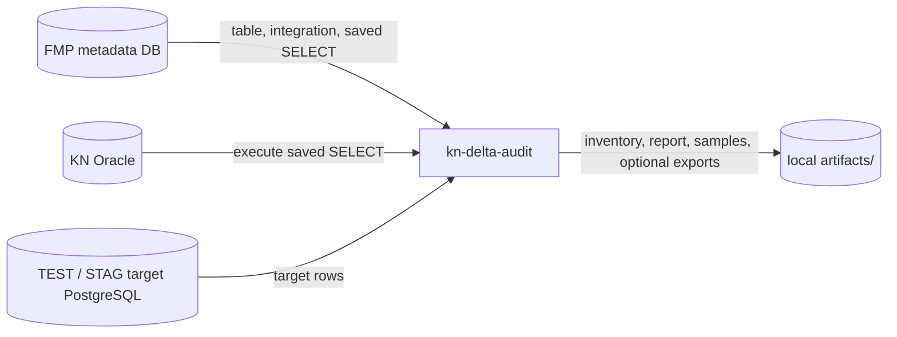
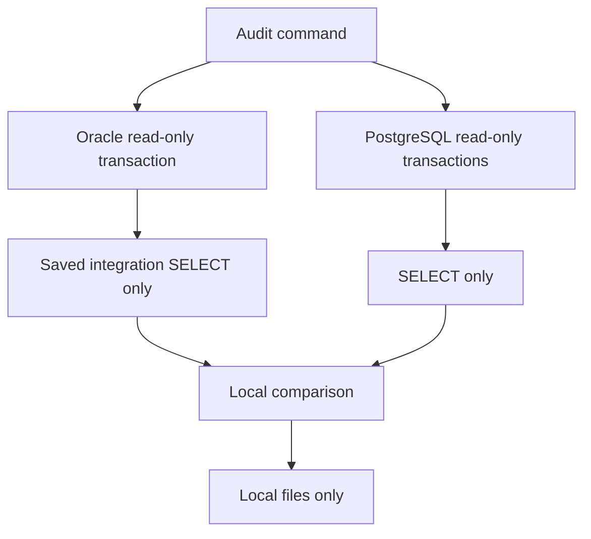
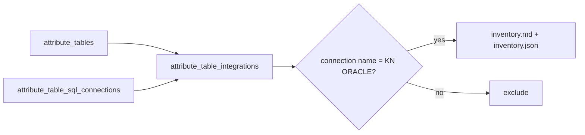
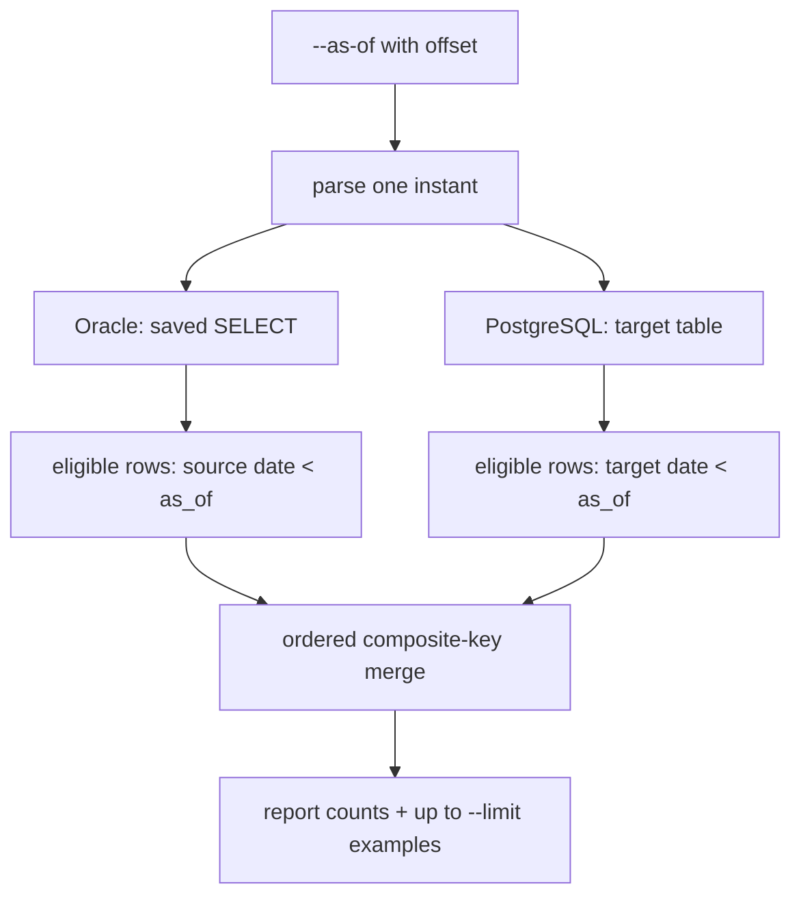
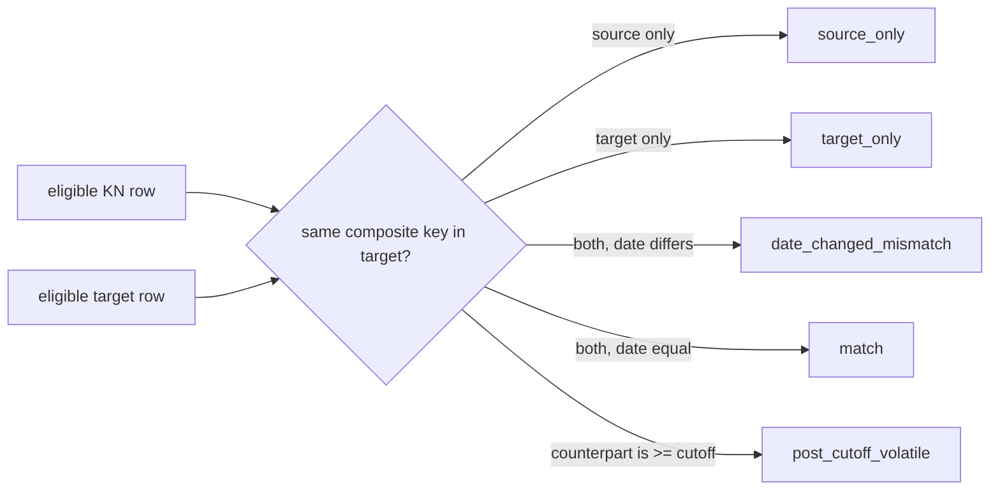
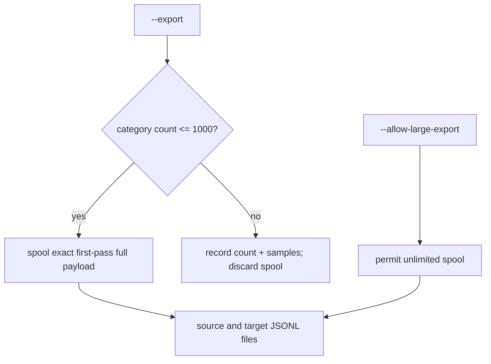

# KN delta audit — ideas and architecture

## Purpose

- Discover FMP integrations that read from `KN ORACLE`.
- Select a small set of tables.
- Compare the saved integration `SELECT` with its PostgreSQL target.
- Use one explicit cutoff: `DATE_CHANGED < as_of`.
- Find missing rows in both directions and changed timestamps.
- Optionally keep full local evidence for bounded delta sets.
- Never write to Oracle, PostgreSQL, or FMP metadata.

## Systems



## Safety boundary



- No `INSERT`, `UPDATE`, `DELETE`, DDL, or integration execution.
- Integration SQL is taken from FMP metadata; raw KN tables are not reconstructed.
- Identifiers and selection names are validated before use.
- DB sessions use `Europe/Ljubljana`.
- Oracle and PostgreSQL are separate snapshots. The cutoff reduces race effects; it cannot create one cross-database transaction.

## Step 1 — discover KN integrations



Command:

```sh
.venv/bin/kn-delta-audit discover --environment test --output-dir artifacts
```

Inventory includes:

- target table name
- integration UUID
- connection name
- `last_changed_datetime`
- saved integration SQL and its hash
- ambiguity warnings: zero/multiple KN integrations

Discovery needs PostgreSQL/FMP credentials only. It does not contact KN Oracle.

## Step 2 — choose tables and keys

Create `selected_tables.json` from inventory.

```json
{
  "tables": [
    {
      "name": "kn_nep_deli_stavb_h",
      "integration_id": "PUT-UUID-FROM-INVENTORY-HERE",
      "target_table": "kn_nep_deli_stavb_h",
      "target_schema": "public",
      "keys": [
        { "source": "DEL_STAVBE_H_ID", "target": "del_stavbe_h_id" }
      ],
      "source_date": "DATE_CHANGED",
      "target_date": "date_changed"
    }
  ]
}
```

Rules:

- `keys` are the ordered integration/business composite key.
- Do **not** use LIFT-generated `id`.
- The saved SQL must expose every source key and `source_date` alias.
- The PostgreSQL target must expose every target key and `target_date` column.
- UUID values in the example are placeholders; copy the real value from `inventory.json`.

## Step 3 — run one stable audit



Example:

```sh
.venv/bin/kn-delta-audit audit \
  --environment test \
  --selection selected_tables.json \
  --as-of '2026-08-07T10:00:00+02:00' \
  --limit 20 \
  --output-dir artifacts
```

`--as-of` is mandatory and must include an offset. It is recorded in UTC and in the artifact name.

## Result categories



- `source_only`: row exists in KN integration result, not target.
- `target_only`: row exists in target, not KN integration result.
- `date_changed_mismatch`: same key; different eligible `DATE_CHANGED`.
- `post_cutoff_volatile`: counterpart exists only with a value at/after cutoff. Excluded from normal deltas and from default export, so a recent change is not misreported as a historical absence.
- Null `DATE_CHANGED`, null eligible key, duplicate key, unsafe SQL, mismatched key types, or metadata mismatch: table failure with detail in the report.

## Optional full evidence export



Example:

```sh
.venv/bin/kn-delta-audit audit \
  --environment test \
  --selection selected_tables.json \
  --as-of '2026-08-07T10:00:00+02:00' \
  --export --max-export-rows 1000 \
  --output-dir artifacts
```

- Default cap: 1,000 rows **per category**.
- `--limit 20` affects samples only, never counts or full-export cap.
- `--allow-large-export` is an explicit override; it can create large local files.
- Export rows come from the first comparison pass, not a later reread.
- `source_only`: full integration projection.
- `target_only`: full target row.
- timestamp mismatch: separate source and target full-row files.
- Over-cap non-overridden exports are skipped safely after retaining only cap + 1 temporary payload rows.

## Files produced per run

```text
artifacts/
  audit_<UTC-run-time>_asof_<cutoff>/
    report.md
    manifest.json
    <table>_*_samples.jsonl
    <table>_<category>_<source-or-target>.jsonl    # only --export
```

`manifest.json` is the audit record:

- environment; run start/end; cutoff; predicate; timezone
- integration ID; SQL hash; key/date mappings
- exact counts; sample limit; export cap/override
- export paths/skips; table-specific errors
- cross-database snapshot limitation

## Before a real run

1. Fill ignored `.env` from `.env.example`.
2. Use `test` first.
3. Run `discover`.
4. Review inventory and create `selected_tables.json`.
5. Pick a deliberate cutoff in the past, including timezone offset.
6. Run audit without `--export`.
7. Inspect `report.md`, `manifest.json`, and samples.
8. Add `--export` only for useful, bounded delta sets.
9. Later repeat with `--environment stag`; do not change the selection's key mappings without review.

## Local setup and verification

```sh
python3 -m venv .venv
.venv/bin/python -m pip install -e '.[test]'
.venv/bin/python -m pytest -q
```

Current unit suite: eight tests; database access is not required for it.
